# Raspberry Pi OS Upgrade – Debian 12 Bookworm to Debian 13 Trixie

## Project Overview

This project involved upgrading an existing Raspberry Pi from Debian 12 (Bookworm) to Debian 13 (Trixie) using the Linux command line.

The Raspberry Pi had previously been used within an office environment to display system statistics but had been unused for several months. Rather than rebuilding the device from scratch, I used the project as an opportunity to perform an in-place operating system upgrade while developing my practical Linux administration and troubleshooting skills.

The project included assessing the existing system, reviewing available packages, changing the configured repositories from Bookworm to Trixie, simulating changes before implementation, completing the operating system upgrade, troubleshooting package conflicts and verifying the condition of the system afterwards.

A package conflict occurred during the upgrade, meaning that troubleshooting became an important part of the project. I investigated the affected packages, simulated potentially disruptive changes before applying them, repaired the package state and then continued with the upgrade.

The final system was successfully upgraded to Debian 13 (Trixie), with the upgraded kernel running and no failed systemd services identified during final verification.

---

## Project Objectives

The objectives of the project were to:

- Establish the existing operating system and system condition.
- Identify available package upgrades.
- Prepare the Raspberry Pi for an operating system upgrade.
- Change the configured repositories from Bookworm to Trixie.
- Verify repository configuration before continuing.
- Simulate package changes where possible before execution.
- Upgrade the operating system through the command line.
- Troubleshoot package conflicts encountered during implementation.
- Verify network and Domain Name System (DNS) connectivity.
- Perform post-upgrade operating system and service checks.
- Confirm that the Raspberry Pi was operating successfully following the upgrade.

---

# 1. Initial System Assessment

Before making any changes, I established a baseline of the existing Raspberry Pi environment.

I checked the installed operating system using:

```bash
cat /etc/os-release
```

I also checked the running Linux kernel using:

```bash
uname -a
```

The results confirmed that the Raspberry Pi was running **Debian GNU/Linux 12 (Bookworm)** before the upgrade.

Establishing this baseline was important because it provided evidence of the original configuration and gave me information that could later be compared against the upgraded system.

<p align="center">
  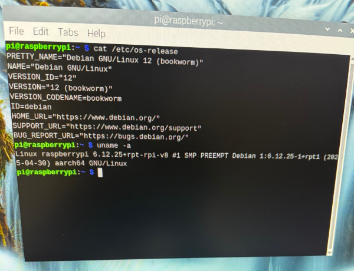
</p>

<p align="center">
  <em>Figure 1 – Initial operating system and kernel verification showing Debian 12 (Bookworm).</em>
</p>

---

# 2. Package Assessment

Before attempting the operating system upgrade, I refreshed the available package information and reviewed the packages that could be upgraded.

```bash
sudo apt update
```

I then used:

```bash
apt list --upgradable
```

This showed that a significant number of packages had newer versions available.

Reviewing the packages before proceeding helped establish the existing condition of the device and gave me an indication of the scale of the changes that would be required.

<p align="center">
  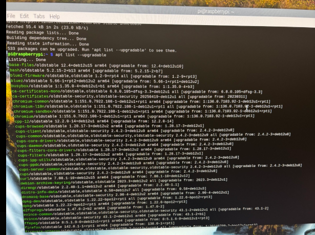
</p>

<p align="center">
  <em>Figure 2 – Package assessment showing packages available for upgrade.</em>
</p>

---

# 3. Repository Configuration

The system was originally configured to retrieve packages for Debian 12 Bookworm. To perform the distribution upgrade, the configured package sources needed to reference Debian 13 Trixie.

Before changing the configuration, I identified the existing Bookworm references within the Advanced Package Tool (APT) source configuration.

I then replaced the relevant Bookworm references with Trixie and checked the configuration afterwards.

The repository configuration was verified using `grep` so that I could confirm that the required entries referenced Trixie before performing the upgrade.

This verification step was important because incorrect repository configuration could result in packages being retrieved from the wrong distribution or leave the system in an inconsistent state.

<p align="center">
  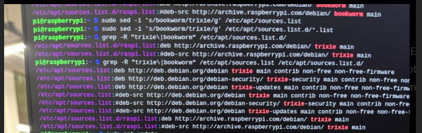
</p>

<p align="center">
  <em>Figure 3 – Repository configuration changed from Bookworm to Trixie and checked before continuing.</em>
</p>

---

# 4. Refreshing Trixie Package Information

Once the repository configuration had been changed, I refreshed APT:

```bash
sudo apt update
```

This caused the Raspberry Pi to retrieve package metadata from the newly configured Trixie repositories.

I checked the output carefully for repository errors before attempting the operating system upgrade.

The successful retrieval of package information confirmed that the Raspberry Pi could communicate with the configured Debian and Raspberry Pi repositories and that Trixie packages were available to the system.

---

# 5. Simulating the Upgrade

Before making major package changes, I used APT's simulation functionality to inspect what the package manager intended to do.

For example:

```bash
sudo apt-get -s upgrade
```

The `-s` option performs a simulation rather than actually installing or removing packages.

This allowed me to review the proposed package changes without immediately modifying the system.

<p align="center">
  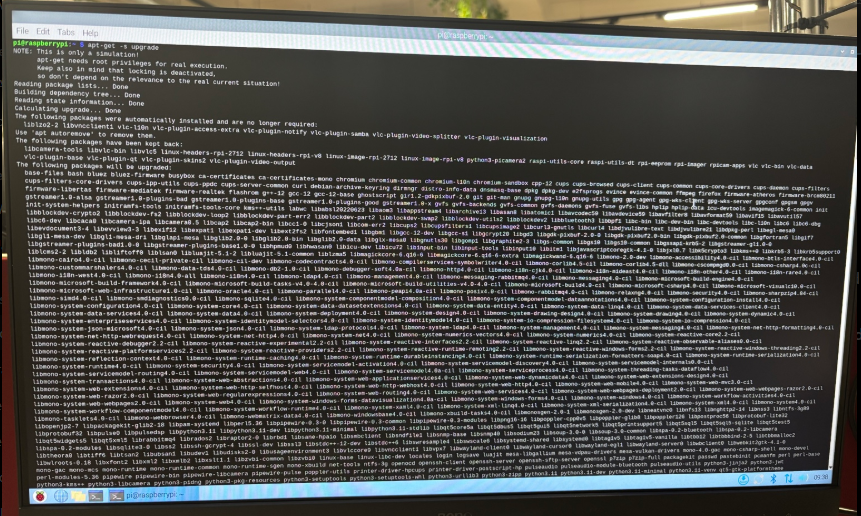
</p>

<p align="center">
  <em>Figure 4 – Simulated package upgrade used to review the proposed changes before execution.</em>
</p>

I also reviewed the proposed full distribution upgrade before proceeding.

<p align="center">
  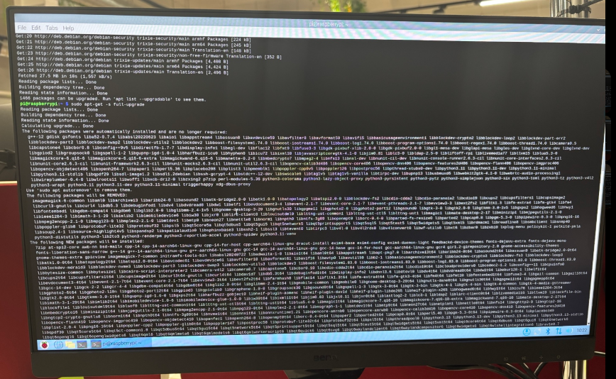
</p>

<p align="center">
  <em>Figure 5 – Review of the packages affected by the planned full operating system upgrade.</em>
</p>

Simulation became particularly useful later in the project when troubleshooting package conflicts because it allowed me to check the expected effect of removing packages before performing the actual removal.

---

# 6. Executing the Operating System Upgrade

After reviewing the proposed changes, I proceeded with the full upgrade:

```bash
sudo apt full-upgrade
```

Unlike a standard package upgrade, `full-upgrade` can resolve changing dependencies by installing new packages or removing packages where required.

Because this was a major distribution upgrade, I monitored the terminal output throughout the process rather than leaving the upgrade unattended.

<p align="center">
  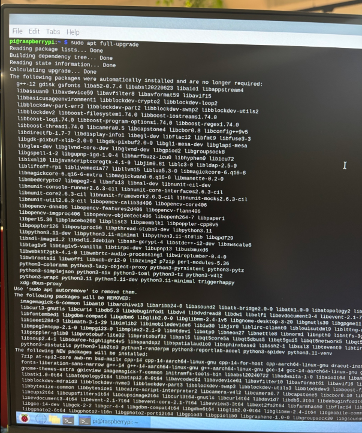
</p>

<p align="center">
  <em>Figure 6 – Execution of the full operating system upgrade.</em>
</p>

During this process, the upgrade encountered a package installation error.

---

# 7. Troubleshooting the Package Conflict

## Identifying the Error

During the upgrade, `dpkg` returned an error while processing a package.

The output included:

```text
Sub-process /usr/bin/dpkg returned an error code (1)
```

Rather than repeatedly running the upgrade command, I investigated the package state to determine what was preventing the installation from completing.

<p align="center">
  
</p>

<p align="center">
  <em>Figure 7 – Package processing error encountered during the Trixie upgrade.</em>
</p>

This became the main troubleshooting stage of the project.

---

## Investigating LXPanel Packages

The investigation identified packages associated with LXPanel and its plugins as part of the conflict.

I used APT package information to compare installed and candidate versions, including:

```bash
apt-cache policy lxplug-batt lxpanel lxpanel-data
```

This allowed me to see which versions were currently installed and which versions were being offered by the Trixie repositories.

<p align="center">
  
</p>

<p align="center">
  <em>Figure 8 – Investigation of installed and candidate LXPanel-related package versions.</em>
</p>

The results helped identify legacy Raspberry Pi desktop components that were interfering with the newer package set.

---

# 8. Simulating Package Removal

I did not immediately remove the suspected package.

Instead, I first simulated the removal using `dpkg`:

```bash
sudo dpkg --no-act --remove lxplug-batt
```

The `--no-act` option allowed me to see what `dpkg` intended to do without making the change.

<p align="center">
  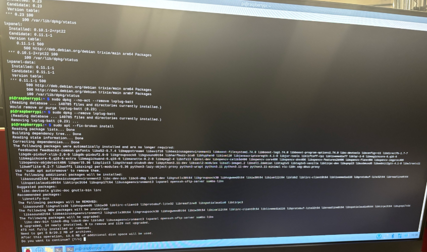
</p>

<p align="center">
  <em>Figure 9 – Simulating removal of the conflicting lxplug-batt package before making the change.</em>
</p>

I also verified the proposed action separately before executing the removal.

<p align="center">
  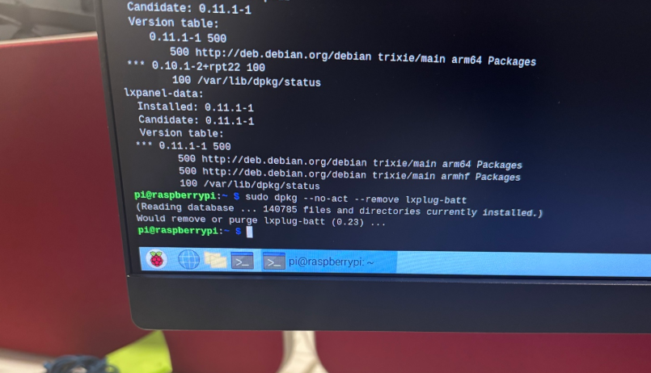
</p>

<p align="center">
  <em>Figure 10 – Verification of the proposed lxplug-batt package removal.</em>
</p>

Using simulation first reduced the risk of making unnecessary changes while troubleshooting.

---

# 9. Removing the Conflicting Packages

Once I had reviewed the simulated result, I proceeded with removal of the conflicting package:

```bash
sudo dpkg --remove lxplug-batt
```

<p align="center">
  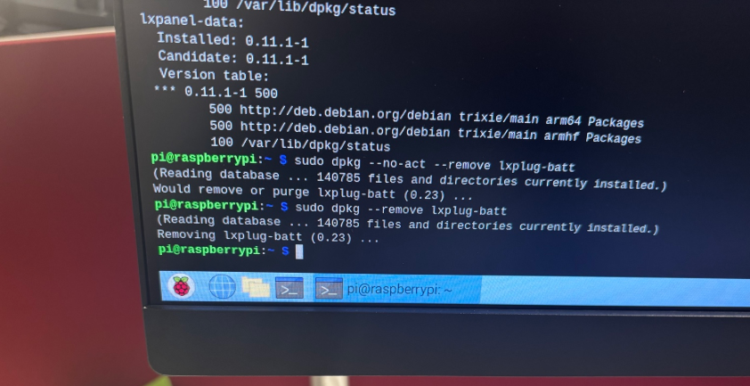
</p>

<p align="center">
  <em>Figure 11 – Removal of the conflicting lxplug-batt package.</em>
</p>

Additional LXPanel plugin components were also investigated where they interfered with the upgrade.

Again, I used a simulation before performing the actual change.

For example:

```bash
sudo dpkg --no-act --remove lxplug-cpu
```

followed by the required removal after checking the expected result.

<p align="center">
  
</p>

<p align="center">
  <em>Figure 12 – Removal of an additional conflicting LXPanel plugin component.</em>
</p>

This part of the project reinforced the importance of understanding what a package-management command will change before executing it, particularly when resolving dependency problems during an operating system upgrade.

---

# 10. Repairing the Package State

After removing the conflicting packages, I used APT's broken dependency repair functionality:

```bash
sudo apt --fix-broken install
```

This instructed APT to attempt to correct the incomplete dependency state created during the interrupted upgrade.

I reviewed the packages that APT proposed to install, upgrade or remove before allowing the repair process to continue.

<p align="center">
  
</p>

<p align="center">
  <em>Figure 13 – Repairing the package state using APT after resolving the package conflict.</em>
</p>

Once the package state had been repaired, I could continue with the remaining upgrade process.

---

# 11. Network and DNS Verification

Network connectivity was also checked as part of the troubleshooting and verification process.

I tested connectivity to a hostname using:

```bash
ping -c 4 raspberrypi.com
```

The hostname successfully resolved to an IP address and all four Internet Control Message Protocol (ICMP) echo requests received responses.

The test reported **0% packet loss**, confirming that the Raspberry Pi had working network connectivity and that Domain Name System (DNS) resolution was functioning.

<p align="center">
  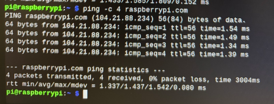
</p>

<p align="center">
  <em>Figure 14 – Successful hostname resolution and network connectivity test with 0% packet loss.</em>
</p>

This was useful because successful IP connectivity alone would not necessarily prove that DNS resolution was working.

---

# 12. Post-Upgrade Repository Verification

Following the upgrade and troubleshooting process, I refreshed the package information again:

```bash
sudo apt update
```

The system successfully communicated with the configured Trixie repositories and retrieved the relevant package information.

<p align="center">
  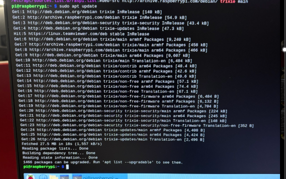
</p>

<p align="center">
  <em>Figure 15 – Post-upgrade package repository verification using the Trixie repositories.</em>
</p>

This confirmed that the system remained configured to use the intended repositories after the upgrade.

---

# 13. Final System Verification

After completing the upgrade, I performed final checks rather than assuming that a completed package installation meant the operating system was healthy.

I checked the running kernel:

```bash
uname -a
```

I then verified the operating system:

```bash
cat /etc/os-release
```

The system now reported:

```text
Debian GNU/Linux 13 (trixie)
```

I also checked for failed systemd services:

```bash
systemctl --failed
```

The result showed:

```text
0 loaded units listed.
```

This confirmed that no failed systemd units were detected during the final verification.

<p align="center">
  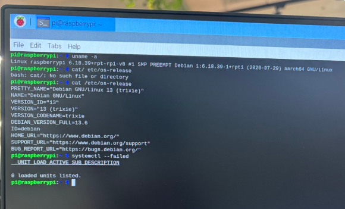
</p>

<p align="center">
  <em>Figure 16 – Final verification showing Debian 13 (Trixie), the upgraded Linux kernel and zero failed systemd services.</em>
</p>

The comparison between the initial and final system state provided clear confirmation that the operating system upgrade had been completed successfully.

---

# 14. Troubleshooting Approach

The most valuable part of this project was the troubleshooting required when the upgrade did not complete without errors.

Rather than treating the error as a reason to rebuild the Raspberry Pi, I worked through the problem by:

1. Identifying the package-processing error.
2. Reviewing the affected package versions.
3. Identifying conflicting LXPanel-related packages.
4. Simulating package removal before making changes.
5. Removing the conflicting packages.
6. Repairing the broken package state.
7. Continuing the upgrade process.
8. Testing network and DNS connectivity.
9. Refreshing package information.
10. Verifying the final operating system and service state.

This changed the project from a straightforward operating system upgrade into a more realistic Linux troubleshooting exercise.

---

# 15. Key Commands Used

| Command | Purpose |
|---|---|
| `cat /etc/os-release` | Display operating system release information |
| `uname -a` | Display kernel and system information |
| `sudo apt update` | Refresh package repository information |
| `apt list --upgradable` | Display packages with available upgrades |
| `grep` | Search repository configuration for Bookworm/Trixie references |
| `sudo apt-get -s upgrade` | Simulate a package upgrade |
| `sudo apt full-upgrade` | Perform the full package/distribution upgrade |
| `apt-cache policy` | Compare installed and candidate package versions |
| `dpkg -S` | Identify which package owns a particular file |
| `sudo dpkg --no-act --remove` | Simulate removal of a package |
| `sudo dpkg --remove` | Remove a conflicting package |
| `sudo apt --fix-broken install` | Repair broken package dependencies |
| `ping -c 4 raspberrypi.com` | Test DNS resolution and network connectivity |
| `systemctl --failed` | Identify failed systemd services |

---

# 16. Skills Developed

This project developed my practical understanding of:

- Linux operating system administration
- Debian and Raspberry Pi OS
- Command-line administration
- APT package management
- `dpkg` package management
- Linux package dependencies
- Repository configuration
- Distribution upgrades
- Upgrade simulation and change validation
- Linux troubleshooting
- DNS and network testing
- systemd service verification
- Technical documentation
- Post-change verification
- Risk reduction when making system changes

---

# 17. Lessons Learned

One of the main lessons from the project was that an operating system upgrade involves considerably more than running a single upgrade command.

Repository configuration, package dependencies, available disk space, network connectivity and existing software can all affect whether an upgrade completes successfully.

The package conflict was particularly useful from a learning perspective. Instead of immediately removing packages when an error appeared, I investigated the installed and candidate versions and used simulation commands before making changes. This gave me greater confidence that the proposed remediation was appropriate.

I also gained a better understanding of the relationship between APT and `dpkg`. APT provides higher-level package and dependency management, whereas `dpkg` operates directly on Debian packages. During troubleshooting, both were useful for understanding and repairing the package state.

The project also reinforced the importance of verification. A command completing without an obvious error does not necessarily prove that an operating system is healthy. Checking the final OS version, running kernel, repositories, connectivity and failed services provided much stronger evidence that the upgrade had been successful.

---

# Project Outcome

The Raspberry Pi was successfully upgraded from **Debian 12 (Bookworm) to Debian 13 (Trixie)**.

The upgrade encountered package conflicts involving legacy LXPanel-related components, which required additional investigation and remediation. The affected packages were investigated, removal was simulated before implementation, the broken package state was repaired and the upgrade was successfully completed.

Final verification confirmed:

- **Debian GNU/Linux 13 (Trixie)** was installed.
- The Raspberry Pi was running the upgraded Linux kernel.
- Trixie repositories were accessible.
- Network connectivity was operational.
- DNS resolution was operational.
- No failed systemd services were detected.

The project provided practical experience of completing and troubleshooting an in-place Linux distribution upgrade rather than simply rebuilding the device when problems occurred.
